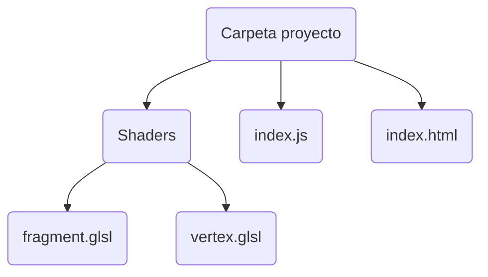

# Project structure

WebGL projects have at least 4 file types:

- **HTML** with the page structure.
- **CSS** with the page style.
- **JavaScript** with the logic.
- [[Shaders]] with the data sent to the GPU.



# Shaders

The first thing to do is to create the **shaders** in text files with extension `.glsl`. 

___
The first line in a shader file must be `#version 300 en`, without spaces or comments. It indicates that we want to use the webgl2 GLSL. Otherwise it will use version 1 by default.
___

Let's start with the **vertex shader**. The **vertex shader** needs [[Shaders|inputs]] to receive data from JavaScript, and in this example a **buffer** is being used (via the **attribute** `a_position`). The **vertex shader** is executed iteratively. In each iteration it extracts some data from the buffer and the logic of the function is executed.

```C
#version 300 es  
  
// An attribute will receive data from a buffer  
in vec4 a_position;  
   
// All shaders have a main function  
void main() {  
 // gl_Position is a special variable a vertex shader  
 // is responsible for setting 
 gl_Position = a_position;  
}
```

___
The available types for attributes are: `float`, `vec2`, `vec3`, `vec4`, `mat2`, `mat3`, `mat4`, `int`, `ivec2`, `ivec3`, `ivec4`, `uint`, `uvec2`, `uvec3` and `uvec4`.
___

Next, we are going to make a basic **fragment shader**. We are just describing a color using a 4-component vector (RGBA).

```c
#version 300 es  
  
// fragment shaders don't have a default precision so we need  
// to pick one. highp is a good default. It means "high precision"  
precision highp float;  
  
// we need to declare an output for the fragment shader  
out vec4 outColor;  
   
void main() {  
 outColor = vec4(1, 0, 0.5, 1); // return reddish-purple  
}
```


# HTML and CSS

This html is a minimal file that has only two elements: the `canvas` where we are going to render the webGL output and the `script` that references the js file.

```html
<!DOCTYPE html>  
<html lang="en">  
 <head>  
	 <meta charset="UTF-8">  
	 <meta http-equiv="X-UA-Compatible" content="IE=edge">  
	 <meta name="viewport" content="width=device-width, initial-scale=1.0">  
	 <link rel="stylesheet" href="styles.css">  
	 <title>Document</title>  
 </head>  
 <body>  
	 <canvas id="c"></canvas>  
	 <script src="index.js"></script>  
  </body>  
</html>
```

On the other hand, the css file contains basic generic code and is limited to making the **canvas** fill the entire page.

```css
* {  
    margin: 0;  
    padding: 0;  
    box-sizing: border-box;  
    overflow: hidden;  
}  
  
canvas {  
    width: 100vw;  
    height: 100vh;  
}
```

# Javascript

JavaScript code is the most verbose and confusing at first. It all boils down to:

1. create a **program** composed of 2 **shaders**.
2. Pass data to that program to render things.

In this example we are going to draw a triangle. The color we have defined in the **fragment shader**, but the geometry we have to pass it as a **buffer** to the `a_position` attribute we have created in the **vertex shader**. The steps are as follows:

___

1. Create a **buffer** and pass it to the GPU. This can be done with **bind points**. They are kind of like global variables: we can assign resources (like **buffers**) to **bind points** and then other functions can access them.

>`gl.createBuffer` creates a new empty buffer.

>`gl.bindBuffer` selects a buffer.

>`gl.bufferData` copy the given data to the selected buffer.

>`gl.STATIC_DRAW` indicates that we are not going to change this data much during program execution.

___

2. Initialize the **attribute** of the **vertex shader** and tell webGL how to extract data from it.

>`gl.enableVertexAttribArray` tells WebGL that we want to pass data to that attribute from a buffer.

>`gl.vertexAttribPointer` assigns a given **attribute** with the last **buffer** selected with `gl.bindBuffer`. Two things to note:
>
>>If we use 1 buffer for each data type (which is the most common practice) the `stride` and `offset` parameters will always be zero. 
>
>>The `normalize` parameter is useful for non-float types (e.g. a byte will go from -1 to 1 instead of 0 to 255). This is useful especially for colors, which generally go from 0 to 1; if `normalize=true` we can use an integer instead of a float, saving a lot of memory.

___

Also, some important things to keep in mind:

> `ARRAY_BUFFER` can be used to bind several attributes, one after the other. The attributes already assigned will not change.

>You are using `bindVertexArray` twice: the first time when creating the geometry, and the second time just before rendering. Although it may seem redundant, this pattern will make more sense when working with multiple objects. More information [here](https://stackoverflow.com/a/58389266/14627620).

> In WebGL the `vec4` objects have by default a `(0,0,0,1)` value. The `a_position` attribute is declared as `vec4`, and with `gl.vertexAttribPointer` we have told it to access 2 buffer components per iteration. This means that in the vertex shader the attribute will only access the first two values of the `a_position` vector in each iteration (x, y), leaving the other two by default.

 >`gl.viewport` transforms the coordinates of the **clip space** to pixels on the screen. The coordinates defining the triangle have been passed in **clip space**, which goes from -1 to +1 in XY.

>`gl.clearColor(0, 0, 0, 0);` makes the **canvas** transparent.

>`gl.drawArrays` executes the **program** and draws on the canvas. The `count` parameter specifies the number of iterations or times the shader will be executed.  In this case it will be executed 3 times: once for each vertex of the triangle we are drawing. In each iteration, the `a_position` attribute will have two values (X, Y coordinates). Also, we have set the `primitiveType` as `gl.TRIANGLES`, so every 3 iterations webGL will draw a triangle.

```js
main();

async function main() {
  const gl = getWebGLContext();
  const program = await createProgramAndShaders(gl);
  const vao = createTriangleInClipSpace(gl, program);
  setupSizing(gl);
  clearCanvas(gl);
  draw(gl, vao);
}


function getWebGLContext() {
  const canvas = document.getElementById("c");
  const gl = canvas.getContext("webgl2");
  if (!gl) throw new Error("You do not support webgl2!");
  return gl;
}


async function createProgramAndShaders(gl) {
  const program = gl.createProgram();
  await createShaders(gl, program);
  gl.linkProgram(program);

  const success = gl.getProgramParameter(program, gl.LINK_STATUS);

  if (success) {
    gl.useProgram(program);
    return program;
  }

  // If there's an error, log it
  console.log(gl.getProgramInfoLog(program));
  gl.deleteProgram(program);
}


function createTriangleInClipSpace(gl, program) {
  const positions = [0, 0, 0.75, 0, 0.75, 0.75];
  const positionsArray = new Float32Array(positions);

  // Initialize buffer and bind it
  const positionBuffer = gl.createBuffer();
  gl.bindBuffer(gl.ARRAY_BUFFER, positionBuffer);
  gl.bufferData(gl.ARRAY_BUFFER, positionsArray, gl.STATIC_DRAW);

  // Enable attribute
  return setupPositionBufferAttribute(gl, program);
}


function setupSizing(gl) {
  const width = gl.canvas.clientWidth;
  const height = gl.canvas.clientHeight;
  gl.canvas.width = width;
  gl.canvas.height = height;

  // Tell WebGL how to convert from clip space to pixels
  gl.viewport(0, 0, gl.canvas.width, gl.canvas.height);
}


function clearCanvas(gl) {
  gl.clearColor(0, 0, 0, 0);
  gl.clear(gl.COLOR_BUFFER_BIT);
}
 

function setupPositionBufferAttribute(gl, program) {

  // Create a collection of attribute state called Vertex Array Object
  const vao = gl.createVertexArray();

  // Make it the current Vertex Array Object
  gl.bindVertexArray(vao);

  // Look up where the vertex data is and turn on the attribute
  const posAttrLocation = gl.getAttribLocation(program, "a_position");
  gl.enableVertexAttribArray(posAttrLocation);

  // Tell the attribute how to get data out of positionBuffer
  gl.vertexAttribPointer(
    posAttrLocation,
    2, // 2 components per iteration
    gl.FLOAT, // the data is 32bit floats
    false, // normalize = false: don't normalize the data
    0, // stride = 0: move forward size * sizeof(type) each iteration
    0 // offset = 0: start at the beginning of the buffer
  );

  return vao;

}

  

function draw(gl, vao) {
  // Bind the attribute/buffer set we want (stored in a Vertex Array Object)
  gl.bindVertexArray(vao);

  // Draw the result
  const offset = 0;
  const primitiveType = gl.TRIANGLES;
  const count = 3;
  gl.drawArrays(primitiveType, offset, count);

}

  

async function createShaders(gl, program) {
  const fragmentPath = "./shaders/vertex.glsl";
  const vertexPath = "./shaders/fragment.glsl";

  // Get the strings for our GLSL shaders
  const vertexShaderSource = await getShaderSource(fragmentPath);
  const fragmentShaderSource = await getShaderSource(vertexPath);

  // Load GLSL shaders, compile them and attach to program
  createShader(gl, gl.VERTEX_SHADER, vertexShaderSource, program);
  createShader(gl, gl.FRAGMENT_SHADER, fragmentShaderSource, program);
}

  

function createShader(gl, type, source, program) {
  const shader = gl.createShader(type);
  gl.shaderSource(shader, source);
  gl.compileShader(shader);
  const success = gl.getShaderParameter(shader, gl.COMPILE_STATUS);
  if (success) gl.attachShader(program, shader);

  // If there's an error, log it
  console.log(gl.getShaderInfoLog(shader));
  gl.deleteShader(shader);
}


async function getShaderSource(path) {
  const response = await fetch(path);
  return await response.text();
}
```

![[Pasted image 20211231171433.png]]

# From clip space to pixels

We can change the **vertex shader** to be able to pass it the data in pixels instead of **clip space**, which is usually more convenient when using webGL for 2D. We simply have to make the transformation from one system to another inside `vertexShader.glsl` with these steps:

- Scale the coordinates from 0 to 1 (dividing by the resolution).
- Scale the coordinates from 0 to 2.
- Shift the coordinates one unit to the left.
- Scale the Y axis by -1 to invert the coordinates vertically.

>In this case we have changed the `a_position` attribute to `vec2` because, following the previous example, we are only using 2 buffer values in each iteration (XY coordinates). In addition we have defined a **uniform** called `u_resolution` to pass to the shader the resolution of the image to render.

```c
#version 300 es  
  
// An attribute will receive data from a buffer  
in vec2 a_position;  
  
// Uniform to define resolution  
uniform vec2 u_resolution;  
   
// All shaders have a main function  
void main() {  
	
	// convert the position from pixels to 0.0 to 1.0  
	vec2 zeroToOne = a_position / u_resolution;  
	 
	 // convert from 0->1 to 0->2  
	vec2 zeroToTwo = zeroToOne * 2.0;  
	 
	 // convert from 0->2 to -1->+1 (clip space)  
	vec2 clipSpace = zeroToTwo - 1.0;  
	 
	// gl_Position is a special variable a vertex shader  
	// is responsible for setting 
	gl_Position = vec4(clipSpace * vec2(1, -1), 0, 1);  
}
```

We can initialize the **uniform** using `gl.uniform2f` and passing it as argument the width and height of the current canvas. WARNING: This logic has to be after the `setupSizing` function that we created before.

```js
function setResolution(gl, program) {  
    const location = gl.getUniformLocation(program, "u_resolution");  
    gl.uniform2f(location, gl.canvas.width, gl.canvas.height);  
}
```

Now we can define the vertices of the buffer as pixels. In this case we are going to draw a rectangle composed of two triangles.

```js
const positions = [  
    10, 20,  
    80, 20,  
    10, 30,  
    10, 30,  
    80, 20,  
    80, 30];
```

To draw the two rectangles we have to change the `count` parameter of the previous example to 6 so that the shader is executed 6 times: 1 time for each vertex of the two triangles that form the rectangle.

```js
const count = 6;  
gl.drawArrays(primitiveType, offset, count);  
```

![[Pasted image 20211231174424.png]]